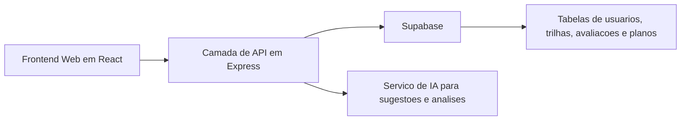
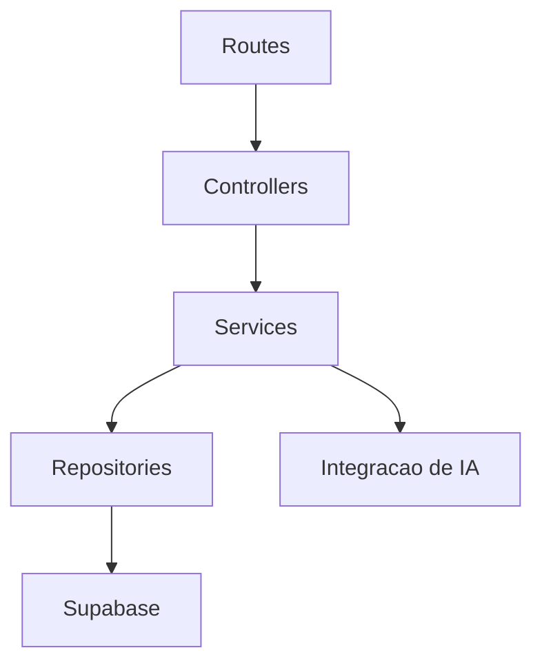
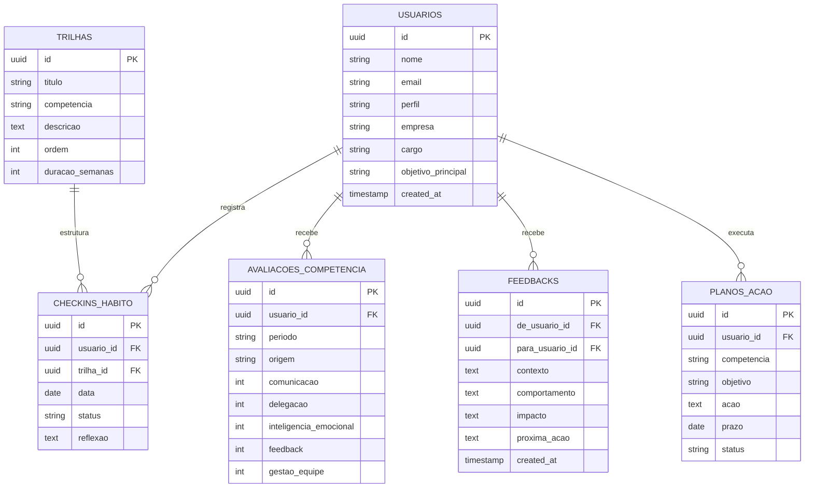

## 1. Desenho de Arquitetura


## 2. Descricao Tecnologica
- Frontend: React 18 + Vite + Tailwind CSS 3
- Inicializacao: Vite
- Backend: Express 4
- Banco de dados: Supabase PostgreSQL
- Autenticacao: login por email e senha com token de sessao
- Estado do app: React Context para sessao e filtros globais, hooks locais para formularios e modulos
- Graficos e visualizacao: biblioteca de graficos para radar, progresso e historico

## 3. Definicoes de Rotas
| Rota | Objetivo |
|-------|---------|
| / | Redirecionar para login ou painel conforme sessao |
| /login | Tela de acesso e cadastro |
| /onboarding | Coletar perfil, desafios e foco inicial do lider |
| /dashboard | Exibir resumo de progresso, indicadores e proximas acoes |
| /trilhas | Mostrar trilhas de desenvolvimento e modulos em andamento |
| /avaliacoes | Centralizar autoavaliacoes, feedbacks e radar de competencias |
| /plano-de-acao | Gerenciar PDIs, compromissos e revisoes |
| /perfil | Exibir configuracoes, preferencias e historico pessoal |
| /admin/lideres | Area de acompanhamento para gestor ou RH |

## 4. Definicoes de API
```ts
type Usuario = {
  id: string;
  nome: string;
  email: string;
  perfil: "lider" | "gestor_rh";
  empresa?: string;
  cargo?: string;
  objetivoPrincipal?: string;
  createdAt: string;
};

type Trilha = {
  id: string;
  titulo: string;
  competencia: string;
  descricao: string;
  ordem: number;
  duracaoSemanas: number;
};

type CheckinHabito = {
  id: string;
  usuarioId: string;
  trilhaId: string;
  data: string;
  status: "feito" | "parcial" | "nao_feito";
  reflexao?: string;
};

type AvaliacaoCompetencia = {
  id: string;
  usuarioId: string;
  periodo: string;
  origem: "autoavaliacao" | "gestor";
  comunicacao: number;
  delegacao: number;
  inteligenciaEmocional: number;
  feedback: number;
  gestaoEquipe: number;
};

type Feedback = {
  id: string;
  deUsuarioId: string;
  paraUsuarioId: string;
  contexto: string;
  comportamento: string;
  impacto: string;
  proximaAcao?: string;
  createdAt: string;
};

type PlanoAcao = {
  id: string;
  usuarioId: string;
  competencia: string;
  objetivo: string;
  acao: string;
  prazo: string;
  status: "pendente" | "em_andamento" | "concluido";
};
```

| Metodo | Endpoint | Objetivo |
|--------|----------|----------|
| POST | /api/auth/login | Autenticar usuario |
| POST | /api/auth/register | Criar conta |
| GET | /api/me | Retornar sessao e perfil |
| GET | /api/dashboard | Buscar resumo do painel |
| GET | /api/trilhas | Listar trilhas disponiveis |
| POST | /api/checkins | Registrar habito ou desafio concluido |
| GET | /api/avaliacoes | Listar avaliacoes por periodo |
| POST | /api/avaliacoes | Salvar autoavaliacao ou avaliacao do gestor |
| GET | /api/feedbacks | Listar feedbacks recebidos e enviados |
| POST | /api/feedbacks | Criar feedback estruturado |
| GET | /api/planos-acao | Listar plano de acao do usuario |
| POST | /api/planos-acao | Criar item de PDI |
| POST | /api/ia/sugestoes | Gerar sugestoes de desenvolvimento com IA |

## 5. Diagrama da Camada de Servidor


## 6. Modelo de Dados
### 6.1 Definicao do Modelo


### 6.2 Linguagem de Definicao de Dados
```sql
create table usuarios (
  id uuid primary key default gen_random_uuid(),
  nome text not null,
  email text not null unique,
  perfil text not null check (perfil in ('lider', 'gestor_rh')),
  empresa text,
  cargo text,
  objetivo_principal text,
  created_at timestamptz not null default now()
);

create table trilhas (
  id uuid primary key default gen_random_uuid(),
  titulo text not null,
  competencia text not null,
  descricao text not null,
  ordem int not null,
  duracao_semanas int not null
);

create table checkins_habito (
  id uuid primary key default gen_random_uuid(),
  usuario_id uuid not null references usuarios(id) on delete cascade,
  trilha_id uuid not null references trilhas(id) on delete cascade,
  data date not null,
  status text not null check (status in ('feito', 'parcial', 'nao_feito')),
  reflexao text
);

create table avaliacoes_competencia (
  id uuid primary key default gen_random_uuid(),
  usuario_id uuid not null references usuarios(id) on delete cascade,
  periodo text not null,
  origem text not null check (origem in ('autoavaliacao', 'gestor')),
  comunicacao int not null check (comunicacao between 1 and 5),
  delegacao int not null check (delegacao between 1 and 5),
  inteligencia_emocional int not null check (inteligencia_emocional between 1 and 5),
  feedback int not null check (feedback between 1 and 5),
  gestao_equipe int not null check (gestao_equipe between 1 and 5)
);

create table feedbacks (
  id uuid primary key default gen_random_uuid(),
  de_usuario_id uuid not null references usuarios(id) on delete cascade,
  para_usuario_id uuid not null references usuarios(id) on delete cascade,
  contexto text not null,
  comportamento text not null,
  impacto text not null,
  proxima_acao text,
  created_at timestamptz not null default now()
);

create table planos_acao (
  id uuid primary key default gen_random_uuid(),
  usuario_id uuid not null references usuarios(id) on delete cascade,
  competencia text not null,
  objetivo text not null,
  acao text not null,
  prazo date not null,
  status text not null check (status in ('pendente', 'em_andamento', 'concluido'))
);

create index idx_checkins_usuario_data on checkins_habito(usuario_id, data desc);
create index idx_avaliacoes_usuario_periodo on avaliacoes_competencia(usuario_id, periodo desc);
create index idx_planos_usuario_status on planos_acao(usuario_id, status);
```
