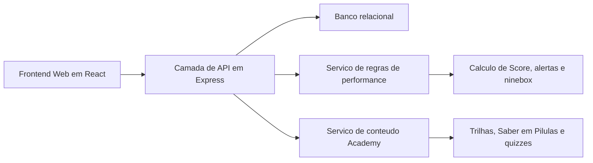
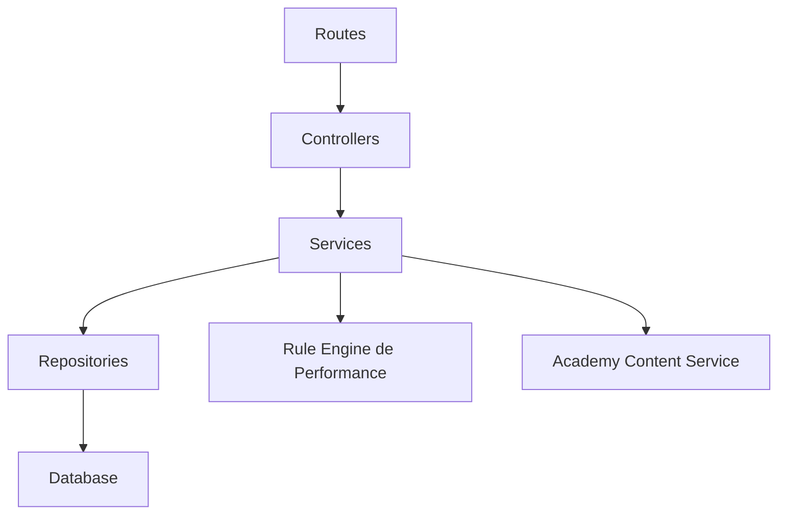
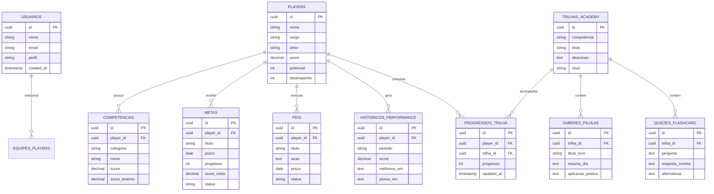

## 1. Desenho de Arquitetura


## 2. Descricao Tecnologica
- Frontend: React 18 + Vite + Tailwind CSS 3
- Inicializacao: Vite
- Backend: Express 4
- Banco de dados: PostgreSQL ou Supabase PostgreSQL
- Autenticacao: login por email e senha com sessao por token
- Estado do app: Zustand para sessao, filtros, player selecionado e dados do dashboard
- Visualizacao: biblioteca de graficos para historicos, comparativos e matriz ninebox
- Estrategia de dados: separar dados mestres de players, ciclos de avaliacao, metas, PDIs, historicos e conteudos Academy
- Escala principal: usar `Score` no intervalo de `1 a 10`

## 3. Definicoes de Rotas
| Rota | Objetivo |
|-------|---------|
| / | Redirecionar para login ou dashboard |
| /login | Tela de acesso |
| /dashboard | Dashboard principal do gestor com alertas e visao executiva |
| /players | Lista geral de players |
| /players/:id | Tela detalhada do player |
| /ninebox | Matriz ninebox com descricoes e filtros |
| /relatorios | Analise historica e comparativos de evolucao |
| /academy | Trilhas de desenvolvimento, minibooks e quiz |
| /academy/trilhas/:id | Detalhamento da trilha e conteudos |

## 4. Definicoes de API
```ts
type Usuario = {
  id: string;
  nome: string;
  email: string;
  perfil: "gestor" | "player" | "rh";
  equipeId?: string;
  createdAt: string;
};

type Player = {
  id: string;
  nome: string;
  cargo: string;
  setor: string;
  score: number;
  potencial: number;
  desempenho: number;
  statusMetas: "em_dia" | "atencao" | "atrasado";
  statusPdi: "em_dia" | "atencao" | "atrasado";
};

type Competencia = {
  id: string;
  playerId: string;
  categoria: "soft" | "hard";
  nome: string;
  score: number;
  scoreAnterior?: number;
};

type Meta = {
  id: string;
  playerId: string;
  titulo: string;
  prazo: string;
  progresso: number;
  scoreMeta: number;
  status: "nao_iniciada" | "em_andamento" | "concluida" | "atrasada";
};

type Pdi = {
  id: string;
  playerId: string;
  titulo: string;
  acao: string;
  prazo: string;
  status: "pendente" | "em_andamento" | "concluido" | "fora_do_prazo";
};

type HistoricoPerformance = {
  id: string;
  playerId: string;
  periodo: string;
  score: number;
  melhorouEm: string[];
  piorouEm: string[];
};

type TrilhaAcademy = {
  id: string;
  competencia: string;
  titulo: string;
  descricao: string;
  nivel: "basico" | "intermediario" | "avancado";
};

type SaberEmPilulas = {
  id: string;
  trilhaId: string;
  tituloLivro: string;
  resumoDia: string;
  aplicacaoPratica: string;
};

type QuizFlashcard = {
  id: string;
  trilhaId: string;
  pergunta: string;
  respostaCorreta: string;
  alternativas: string[];
};
```

| Metodo | Endpoint | Objetivo |
|--------|----------|----------|
| POST | /api/auth/login | Autenticar usuario |
| GET | /api/dashboard | Buscar indicadores principais do gestor |
| GET | /api/players | Listar players com filtros |
| GET | /api/players/:id | Buscar detalhe completo do player |
| GET | /api/players/:id/historico | Buscar historico consolidado do player |
| GET | /api/ninebox | Retornar matriz ninebox e descricao das celulas |
| GET | /api/relatorios | Retornar leitura historica e comparativos |
| GET | /api/academy/trilhas | Listar trilhas da Academy |
| GET | /api/academy/trilhas/:id | Retornar conteudo da trilha, Saber em Pilulas e quiz |
| POST | /api/academy/trilhas/:id/progresso | Salvar progresso de aprendizagem |

## 5. Diagrama da Camada de Servidor


## 6. Modelo de Dados
### 6.1 Definicao do Modelo


### 6.2 Linguagem de Definicao de Dados
```sql
create table usuarios (
  id uuid primary key default gen_random_uuid(),
  nome text not null,
  email text not null unique,
  perfil text not null check (perfil in ('gestor', 'player', 'rh')),
  created_at timestamptz not null default now()
);

create table players (
  id uuid primary key default gen_random_uuid(),
  nome text not null,
  cargo text not null,
  setor text not null,
  score numeric(4,2) not null default 1,
  potencial int not null default 1,
  desempenho int not null default 1
);

create table competencias (
  id uuid primary key default gen_random_uuid(),
  player_id uuid not null references players(id) on delete cascade,
  categoria text not null check (categoria in ('soft', 'hard')),
  nome text not null,
  score numeric(4,2) not null,
  score_anterior numeric(4,2)
);

create table metas (
  id uuid primary key default gen_random_uuid(),
  player_id uuid not null references players(id) on delete cascade,
  titulo text not null,
  prazo date not null,
  progresso int not null default 0,
  score_meta numeric(4,2) not null default 1,
  status text not null check (status in ('nao_iniciada', 'em_andamento', 'concluida', 'atrasada'))
);

create table pdis (
  id uuid primary key default gen_random_uuid(),
  player_id uuid not null references players(id) on delete cascade,
  titulo text not null,
  acao text not null,
  prazo date not null,
  status text not null check (status in ('pendente', 'em_andamento', 'concluido', 'fora_do_prazo'))
);

create table historicos_performance (
  id uuid primary key default gen_random_uuid(),
  player_id uuid not null references players(id) on delete cascade,
  periodo text not null,
  score numeric(4,2) not null,
  melhorou_em text not null,
  piorou_em text not null
);

create table trilhas_academy (
  id uuid primary key default gen_random_uuid(),
  competencia text not null,
  titulo text not null,
  descricao text not null,
  nivel text not null check (nivel in ('basico', 'intermediario', 'avancado'))
);

create table saberes_pilulas (
  id uuid primary key default gen_random_uuid(),
  trilha_id uuid not null references trilhas_academy(id) on delete cascade,
  titulo_livro text not null,
  resumo_dia text not null,
  aplicacao_pratica text not null
);

create table quizzes_flashcard (
  id uuid primary key default gen_random_uuid(),
  trilha_id uuid not null references trilhas_academy(id) on delete cascade,
  pergunta text not null,
  resposta_correta text not null,
  alternativas text not null
);

create table progressos_trilha (
  id uuid primary key default gen_random_uuid(),
  player_id uuid not null references players(id) on delete cascade,
  trilha_id uuid not null references trilhas_academy(id) on delete cascade,
  progresso int not null default 0,
  updated_at timestamptz not null default now()
);

create index idx_players_setor on players(setor);
create index idx_metas_prazo_status on metas(prazo, status);
create index idx_pdis_prazo_status on pdis(prazo, status);
create index idx_historicos_player_periodo on historicos_performance(player_id, periodo desc);
```
