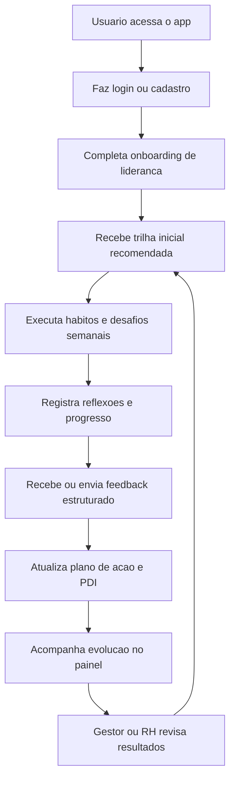

## 1. Visao do Produto
Aplicativo web para desenvolver lideres por meio de trilhas, avaliacoes, feedbacks e planos de acao acompanhados ao longo do tempo.
- Resolve a dificuldade de transformar avaliacao de desempenho em evolucao pratica, com acompanhamento continuo e evidencia de progresso.
- Atende lideres iniciantes, gestores experientes, RH e empresas que precisam desenvolver lideranca com consistencia e visibilidade.

## 2. Funcionalidades Centrais

### 2.1 Perfis de Usuario
| Perfil | Forma de acesso | Permissoes centrais |
|------|------------------|---------------------|
| Lider | Email e senha | Visualizar trilhas, registrar habitos, responder autoavaliacoes, acompanhar feedbacks e executar plano de acao |
| Gestor ou RH | Email e senha | Acompanhar lideres, atribuir trilhas, registrar feedbacks, revisar avaliacoes e acompanhar indicadores |

### 2.2 Modulos Principais
1. **Acesso e onboarding**: login, cadastro, definicao de perfil, objetivo principal e nivel atual de lideranca.
2. **Painel de desenvolvimento**: resumo de progresso, metas da semana, habitos, indicadores de consistencia e proximas acoes.
3. **Trilhas e habitos**: jornadas por competencia, micro-aulas, desafios praticos, check-ins e streaks.
4. **Avaliacoes e feedbacks**: autoavaliacao, avaliacao do gestor, feedbacks estruturados e radar de competencias.
5. **Plano de acao do lider**: PDIs, compromissos, mentorias, revisoes quinzenais e historico de evolucao.

### 2.3 Detalhamento das Paginas
| Nome da pagina | Nome do modulo | Descricao da funcionalidade |
|-----------|-------------|---------------------|
| Acesso e onboarding | Login e cadastro | Autenticar usuario, criar conta, identificar perfil e objetivo inicial |
| Acesso e onboarding | Configuracao inicial | Coletar contexto: nivel de experiencia, principais desafios e foco de desenvolvimento |
| Painel | Resumo semanal | Exibir progresso geral, pontuacao de consistencia, metas em aberto e proximas entregas |
| Painel | Indicadores pessoais | Mostrar evolucao de competencias, habitos concluidos, feedbacks recentes e status do plano |
| Trilhas | Biblioteca de trilhas | Listar trilhas por tema como comunicacao, feedback, delegacao, inteligencia emocional e gestao de equipe |
| Trilhas | Modulo de pratica | Mostrar conteudo curto, desafio do dia, reflexao guiada e check-in de aplicacao |
| Avaliacoes e feedbacks | Radar de competencias | Consolidar autoavaliacao, avaliacao do gestor e historico por periodo |
| Avaliacoes e feedbacks | Feedback estruturado | Registrar feedback por contexto, comportamento, impacto e proxima acao |
| Plano de acao | PDI do lider | Criar objetivos, acoes, prazo, status, evidencias e revisoes |
| Plano de acao | Sessao de mentoria | Registrar encontros, aprendizados, bloqueios e proximos passos |

## 3. Fluxo Principal
O usuario cria a conta, informa seu perfil e objetivo de desenvolvimento, recebe uma trilha inicial e passa a executar micro-acoes semanais. Ao longo do uso, registra habitos e reflexoes, responde autoavaliacoes, recebe feedbacks e atualiza o plano de acao. Gestores ou RH acompanham o progresso e ajudam a ajustar trilhas e prioridades.

## 4. Design da Interface
### 4.1 Estilo Visual
- Cores principais: azul petroleo `#133E57`, areia clara `#F7F3EB`, verde de progresso `#3B7A57` e cobre de destaque `#B86A3B`
- Estilo de botoes: cantos amplos, alto contraste, sombra suave e estados de hover com deslocamento sutil
- Tipografia: fonte editorial para titulos e sans-serif limpa para textos e dados
- Layout: desktop-first, com painel em blocos assimetricos, area de foco semanal e modulos com leitura em camadas
- Iconografia: simbolos lineares e marcadores de progresso com linguagem executiva e humana

### 4.2 Visao de Design por Pagina
| Nome da pagina | Nome do modulo | Elementos de UI |
|-----------|-------------|-------------|
| Acesso e onboarding | Hero de entrada | Fundo texturizado, mensagem aspiracional, formulario enxuto e destaque para proposta de valor |
| Painel | Blocos de progresso | Cards com metas, indicador de consistencia, timeline e visualizacao de competencias |
| Trilhas | Jornada visual | Lista de modulos em formato de percurso, marcadores de conclusao e CTA de proximo passo |
| Avaliacoes e feedbacks | Analise de competencias | Radar chart, cards de feedback, filtros por periodo e comparativo de evolucao |
| Plano de acao | Gestao do PDI | Lista priorizada, status visual, checklists, notas de mentoria e historico de revisoes |

### 4.3 Responsividade
Desktop-first com adaptacao para tablet e mobile, priorizando leitura clara, interacoes por toque e reorganizacao vertical dos paineis sem perda de contexto.
