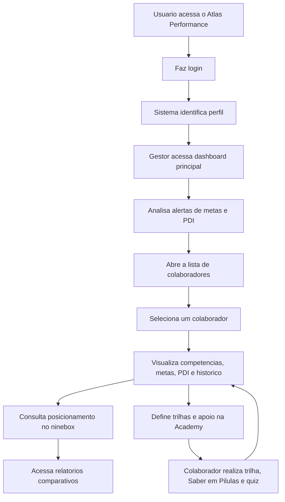

## 1. Visao do Produto
Atlas Performance e uma plataforma web de gestao de performance e desenvolvimento de colaboradores, com foco em acompanhamento do gestor, evolucao individual e decisao baseada em dados.
- Resolve a falta de visibilidade sobre metas, PDIs, desempenho, riscos e progresso de cada colaborador em um unico ambiente.
- Atende principalmente gestores e RH, com experiencia complementar para colaboradores acessarem trilhas, materiais e reforcos de aprendizagem.

## 2. Funcionalidades Centrais

### 2.1 Perfis de Usuario
| Perfil | Forma de acesso | Permissoes centrais |
|------|------------------|---------------------|
| Gestor | Email e senha | Visualizar dashboard geral, acompanhar equipe, editar metas, acompanhar PDI, analisar ninebox e acessar relatorios |
| Colaborador | Email e senha | Visualizar propria performance, metas, PDI, trilhas da Academy, minibooks e quizzes |
| RH ou Administrador | Email e senha | Visualizar visao ampliada, configurar trilhas, acompanhar times e consolidar indicadores |

### 2.2 Modulos Principais
1. **Login e acesso**: autenticacao por email e senha, manutencao da tela de login atual e direcionamento conforme perfil.
2. **Dashboard do gestor**: visao de alertas, metas vencendo, metas atrasadas, PDIs fora do prazo, desempenho por colaborador e pendencias criticas.
3. **Colaboradores**: lista completa de colaboradores, cargo, setor, status de metas, status de PDI e pontuacao media.
4. **Perfil do colaborador**: detalhamento individual com soft skills, hard skills, metas, PDI, historico e pontuacao media.
5. **Ninebox**: posicionamento automatico do colaborador na matriz conforme desempenho e potencial, com descricao clara de cada celula.
6. **Relatorios**: comparativo historico do colaborador, evolucoes, regressos, tendencias e leitura consolidada da jornada.
7. **Academy**: trilhas de desenvolvimento por gap, situacoes praticas, materiais de apoio, Saber em Pilulas e quiz curto em flashcards.

### 2.3 Detalhamento das Paginas
| Nome da pagina | Nome do modulo | Descricao da funcionalidade |
|-----------|-------------|---------------------|
| Login | Acesso | Manter tela de login com autenticacao e entrada segura por perfil |
| Dashboard | Alertas de gestao | Mostrar prazos de metas se encerrando, metas nao entregues, PDIs fora do prazo e colaboradores com risco |
| Dashboard | Resumo executivo | Exibir indicadores da equipe, distribuicao de status, ranking por pontuacao e recomendacoes rapidas |
| Colaboradores | Lista geral | Listar nome, cargo, setor, pontuacao media, status de metas e status do PDI |
| Colaboradores | Filtros | Permitir busca por nome, setor, cargo, status e faixa de pontuacao |
| Colaborador | Soft skills e hard skills | Exibir avaliacoes, gaps e evolucao por competencia |
| Colaborador | Metas | Mostrar metas, prazo, percentual de entrega, status e historico de atualizacoes |
| Colaborador | PDI | Mostrar plano de desenvolvimento, prazos, status, evidencias e pendencias |
| Colaborador | Historico | Exibir comparativo entre ciclos, ganhos e perdas de performance |
| Ninebox | Matriz visual | Posicionar colaboradores automaticamente no ninebox e permitir leitura por celula |
| Ninebox | Descricao das celulas | Explicar o significado estrategico de cada quadrante e acao sugerida |
| Relatorios | Visao historica | Consolidar o que melhorou, o que piorou e o que precisa de atencao por colaborador |
| Relatorios | Exportacao futura | Preparar base para exportar relatorios executivos e analiticos |
| Academy | Trilhas de desenvolvimento | Liberar trilhas conforme gaps, com situacoes reais e aplicacao pratica |
| Academy | Saber em Pilulas | Entregar resumo diario de livros do tema, com sugestoes de aplicacao |
| Academy | Quiz em flashcards | Reforcar o aprendizado com perguntas curtas ao final de cada pilar |

## 3. Fluxo Principal
O gestor faz login e acessa um dashboard orientado a excecoes, identificando rapidamente metas em risco, PDIs fora do prazo e colaboradores com baixa entrega. A partir da lista de colaboradores, ele aprofunda a analise individual, revisa historico, acompanha a posicao no ninebox e identifica necessidades de desenvolvimento. Em paralelo, o colaborador acessa a Academy para consumir trilhas e reforcos de aprendizagem alinhados aos seus gaps.

## 4. Design da Interface
### 4.1 Estilo Visual
- Nome do produto: Atlas Performance
- Cores principais mantidas: azul petroleo `#133E57`, areia clara `#F7F3EB`, verde de progresso `#3B7A57` e cobre de destaque `#B86A3B`
- Linguagem visual: executiva, analitica e premium, com menos aspecto de landing page e mais estrutura de sistema operacional de gestao
- Tipografia: titulos editoriais com corpo tecnico limpo para tabelas, indicadores e historicos
- Layout: desktop-first, com navegacao lateral, dashboards densos, tabelas bem legiveis e modulos de drill-down
- Iconografia: funcional e corporativa, com apoio visual para risco, atraso, evolucao e destaque

### 4.2 Visao de Design por Pagina
| Nome da pagina | Nome do modulo | Elementos de UI |
|-----------|-------------|-------------|
| Login | Acesso | Manter visual atual com refinamento de marca Atlas Performance |
| Dashboard | Indicadores e alertas | Cards executivos, tabela de excecoes, lista de prioridades e area de recomendacoes |
| Colaboradores | Lista e filtros | Tabela principal, busca, filtros e indicadores compactos por linha |
| Colaborador | Painel individual | Cabecalho com identidade do colaborador, cards de media, secoes de metas, PDI, historico e competencias |
| Ninebox | Matriz de talento | Grade 3x3, legenda, quantidade de colaboradores por celula e descricao acionavel |
| Relatorios | Evolucao historica | Comparativos por periodo, destaques de melhora e piora e linha do tempo |
| Academy | Plataforma de desenvolvimento | Trilhas em cards, minibooks diarios, sugestoes praticas e flashcards de quiz |

### 4.3 Responsividade
Desktop-first com adaptacao responsiva para tablet. Em mobile, a prioridade e consulta rapida de indicadores, historico e trilhas, sem perder leitura das informacoes mais criticas.
